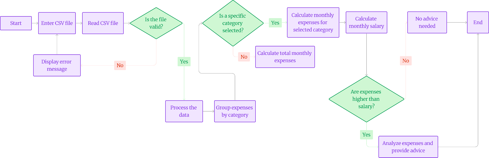

# BudgetBud

<i><b>
"Empowering Your Financial Journey, One Step at a Time."</i></b>

 
  

We are team Binary Bulls and we have developed a web app that's a personally curated financial advisor for users with a busy schedule.

## Problem Statement
In the complex financial landscape, people face challenges managing finances due to limited time and resources. Traditional advisory services lack personalization and involve high fees. We propose an AI-powered financial advisor leveraging machine learning to analyze users' financial data. Considering income, expenses, assets, liabilities, and goals, it offers tailored strategies for budgeting, saving, investing, and retirement planning.

## Objectives
- Democratize access to personalized financial advice and guidance
- Utilize AI algorithms for data analysis and portfolio management
- Empower individuals of all income levels to make informed financial decisions
- Offer educational resources and interactive tools to improve financial literacy
- Prioritize user experience and accessibility
- Ensure availability across multiple devices and languages

## User Process Flow Diagram

## Scope
- Integration of AI algorithms for data analysis and portfolio management
- Implementation of educational resources and interactive tools
- Designing user-friendly interfaces for seamless interaction
- Testing and refinement to ensure accuracy and effectiveness
- Scalability to accommodate growing user base and evolving needs
- Continuous updates and improvements based on user feedback and market trends
